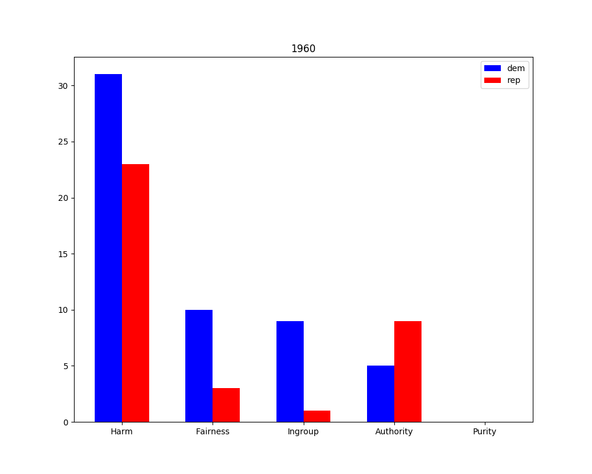

_What we know a priori:_ 
- The perspective analyses for significantly differing words in each moral foundation between each political party. In other words, we have the scores for each moral foundation, for each party, for each year.
- 3-sentence surrounding contexts of said words
- All debate transcripts

_What are we trying to learn?_
- By looking at the moral scores in each debate, we can get a sense of the differences in how each party appealed to the country for specific issues like gay marriage or the war in Iraq.

1. Start the article with an example of how the parties appeal to different morals.
2. I have no idea; going to sleep.

# 1960: "Get America Moving Again" (Kennedy)

Kennedy took advantage of increased Cold War tension by emphasizing a perceived "missile gap" between the United States and Soviet Union. He argued that under the Republicans the Soviets had developed a major advantage in the numbers of nuclear missiles. He proposed a bipartisan congressional investigation about the possibility that the Soviet Union was ahead of the United States in developing missiles. He also noted in an October 18 speech that several senior US military officers had long criticized the Eisenhower Administration's defense spending policies.

## Harm

- "But if you feel that we have to move again in the sixties, that the function of the president is to set before the people the unfinished business of our society as Franklin Roosevelt did in the thirties, the agenda for our people - what we must do as a society to meet our needs in this country and protect our security and help the cause of freedom. As I said at the beginning, the question before us all, that faces all Republicans and all Democrats, is: can freedom in the next generation conquer, or are the Communists going to be successful?" (Kennedy)
- "The means are at issue. If you feel that everything that is being done now is satisfactory, that the relative power and prestige and strength of the United States is increasing in relation to that of the Communists; that we've b- gaining more security, that we are achieving everything as a nation that we should achieve, that we are achieving a better life for our citizens and greater strength, then I agree." (Kennedy)

# 2004

- Purity levels rose because of the presence of gay marriage in the debates.
