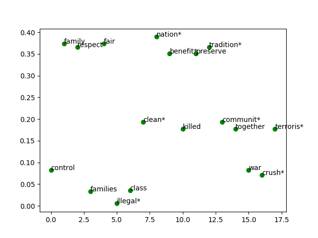
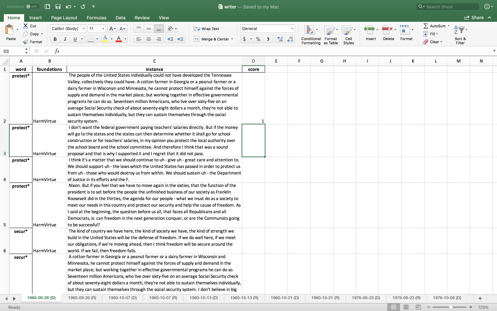
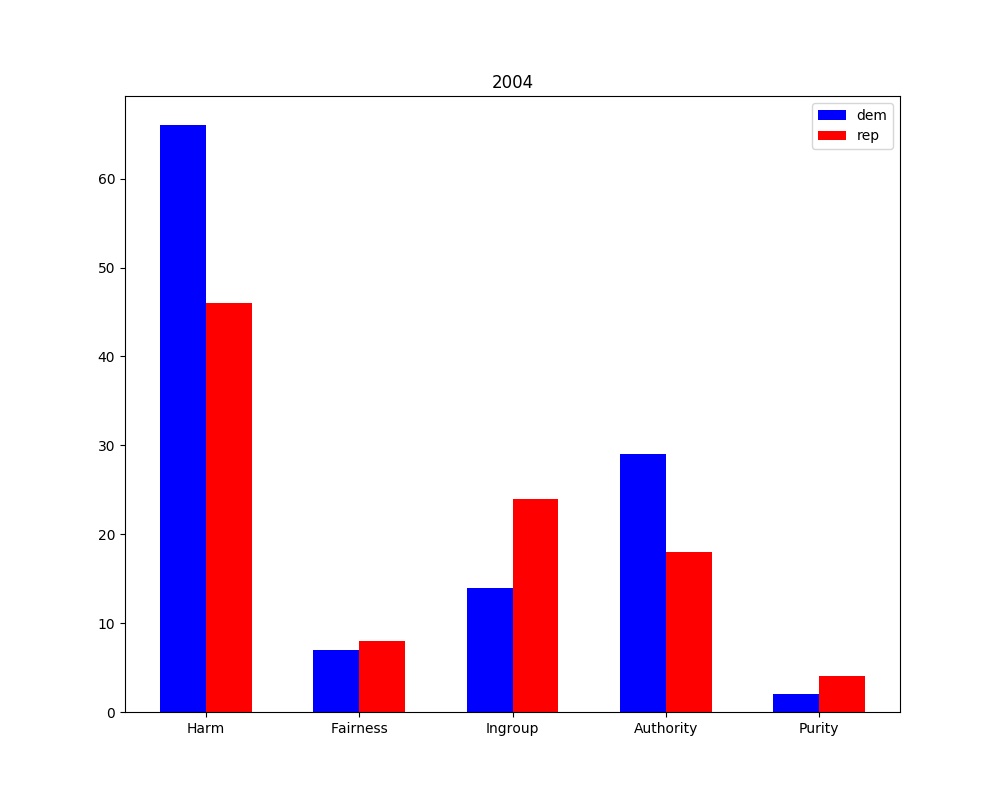

# Properly Partisan

_Properly Partisan_ analyzes the how the Democratic and Republican parties have appealed to our morals since 1960 (the year of the first general presidential debate). For article notes, see [NOTES.md](NOTES.md). For the outline, see [OUTLINE.md](OUTLINE.md).

**This repository contains data collection, sanitization, and analysis. The graphics live in [@brtacks/foundations](https://github.com/brtacks/foundations).**

Debate transcripts can be found at [The American Presidency Project](http://www.presidency.ucsb.edu/debates.php).

# Files

- **contexter.py**: generate a, Excel spreadsheet with N sheets. Each sheet represents one candidate's moral triggers and their contexts (of length 3 sentences).
- **face.py**: gets faces of candidates from Wikipedia and crops into circular icons
- **graph.py**: presents two options for matplotlib graphing, (1) line graphs for each moral foundation across all years, (2) bar graphs for each year across all moral foundations.
- **scrape.py**: scrapes presidential debates from [The American Presidency Project](http://www.presidency.ucsb.edu/debates.php).

# Timeline

- [x] *Scraping:* cleaning transcripts from the web and storing them in formatted CSV's
- [x] *Analysis:* engine to get a targeted word frequency for any transcript
- [x] *1<sup>st</sup> Aggregator:* combining word frequencies for each debate to a Democrat and Republican key
- [x] *2<sup>nd</sup> Aggregator:* combining debate scores for each year (separate primary & general)
- [x] *Writing:* outline and write the article
- [x] *Website:* make the website
- [x] *Data Visualization:* use D3 to create awesome data visualizations

# Literature

## On Measuring Text
- [_Measuring Moral Culture_](https://kenan.ethics.duke.edu/wp-content/uploads/2014/03/Vaisey-and-Miles-Measuring-Moral-Culture-12-16-13.pdf)
- [_Liberals and Conservatives Rely on Different Sets of Moral Foundations_](http://www-bcf.usc.edu/~jessegra/papers/GrahamHaidtNosek.2009.Moral%20foundations%20of%20liberals%20and%20conservatives.JPSP.pdf) Study 4, page 1038-1040
- [_Measuring Moral Rhetoric in Text_](https://www.researchgate.net/publication/258698999_Measuring_Moral_Rhetoric_in_Text) (1-13)

## On Ideology and Sentiment
- [_An Empirical Exploration of Moral Foundations Theory in Partisan News Sources_](https://pdfs.semanticscholar.org/efcc/bf80826d94d15871b077ea75d47722937c40.pdf)
- [_Moral Foundations and Heterogeneity in Ideological Preferences_](http://www.jstor.org/stable/23481157)
- [_Morality Between the Lines: Detecting Moral Sentiment In Text_](http://morteza-dehghani.net/wp-content/uploads/morality-lines-detecting.pdf)
- [ Framing Moral Evaluations: Moral Foundations in U.S. Newspaper Coverage of Mosque Controversies ](https://cedar.wwu.edu/cedarbooks/3/)
- [ The Content Analysis of Media Frames: Toward Improving Reliability and Validity ](https://onlinelibrary.wiley.com/doi/full/10.1111/j.1460-2466.2008.00384.x)

# Data

## Moral Foundations Dictionary
- [Moral Foundations LIWC Dictionary](http://www.moralfoundations.org/sites/default/files/files/downloads/moral%20foundations%20dictionary.dic): a list of 324 of base foundation words

The header section of the file is contained within two percent signs, each on their own line. The lines in between them each contain the hash index of the foundation followed by a tab and the foundation name.
```
%
01    FOUNDATION1_VIRTUE
02    FOUNDATION1_VICE
03    FOUNDATION1_VIRTUE
...
%
```

In the lines underneath, one keyword and its foundation index lie on each line. Some keywords may refer to multiple foundations.
```
...
%
keyword1    01
keyword2    01 02
keyword3    02
...
```

# Methodology

## Scraping Transcripts

| - | Presidential | Vice Presidential | Primary |
| --- | --- | --- | --- |
| 2016 | participants | participants | participants |
| 2012 | _The President.<br>...Romney._ | __...BIDEN:<br>...RYAN:__ | participants |
| 2008 | __OBAMA:__<br>`(?i)`__MCCAIN:__ | __BIDEN:<br>PALIN:__ | participants |
| 2004 | _...Bush.<br/>Kerry._ | CHENEY:<br>EDWARDS: | __DEAN:<br>LIEBERMAN:__<br>... |
| 2000 | BUSH:<br>GORE: | CHENEY:<br>LIEBERMAN: | participants |
| 1996 | _The President.<br>...Dole._ | KEMP:<br>GORE: | - |
| 1992 | Governor Clinton.<br>President Bush. | GORE:<br>...QUAYLE: | - |
| 1988 | DUKAKIS:<br>BUSH: | QUAYLE:<br>BENTSEN: | - |
| 1984 | The President.<br>Mr. Mondale. | FERRARO:<br>BUSH: | - |
| 1980 | THE PRESIDENT.<br>GOVERNOR REAGAN. | - | - |
| 1976 | THE PRESIDENT.<br>MR. CARTER. | DOLE:<br>MONDALE: | - |
| 1960 | MR. NIXON:<br>MR. KENNEDY: | - | - |

## Finding Significant Words








## Good Examples
| Foundation | Supporting | Neutral/Irrelevant | Rejecting |
| --- | --- | --- | --- |
| Ingroup | "We can only be strong overseas if we're strong at home, and when I become President, we'll not only be strong in those areas but also in defense--a defense capability second to none. We've lost, in our **foreign** policy, the character of the American people. We've ignored or excluded the American people and the Congress from participation in the shaping of our foreign policy." _Jimmy Carter (October 6, 1976)_ | But that's the way I, George Bush, feel about it. (Scattered applause) The defense budget today takes far less percentage of the gross **national** product than it did in President Kennedy's time, for example moved tremendously. And you see, I think we're facing a real opportunity for world peace. _George H.W. Bush (October 13, 1988)_ | |
| Authority | "The truth of the matter is, we did cut the increase in spending in half. It at the John doesn't quite realize - he's never held an executive **position** of that kind. And I think being Governor of California is probably the closest thing to the Presidency, if that's possible, of any executive job in America today - because it is the most populous state." _Ronald Reagan (September 21, 1980)_ | "I vetoed a number of bills of that kind myself, when I was in California. Now, whether it is rightful, on a single issue, for anyone to advocate that someone should not be elected or not, I won't take a **position** on that. But I do believe that no one in this country should be denied the right to express themselves, or to even try to persuade others to follow their leader." _Ronald Reagan (September 21, 1980)_ | |
| Harm | | "I am concerned about what that does to our future. I'm concerned about the fact that so many of our _securities_ are in the hands of foreign banks because of these massive deficits. But those are the issues on which we ought to be debating and if we can just put away the flag factories and the balloons and those kinds of thing and get on to a real discussion of these issues, I think we will have a good success." _Michael Dukakis (October 13, 1989)_ | | |
| Purity | "I believe in the **sanctity** of marriage. I think it's very important that we protect marriage as an institution between a man and a woman. I proposed a constitutional amendment. _George W. Bush (October 13, 2004)_ | | |
| Liberty | "I hope we can.Let me begin by saying that my health care plan is not what the President described. It is not a Government takeover." _John Kerry (October 8, 2004)_ | | |


# Limits

- A better MFD could be made since we are specifically looking at political language. Doesn't catch (federal government/big government, top 1%, etc.)
- Only 1 reviewer for qualitative content analysis. Hard examples to rank:
  - Authority: "In giving our people better mental health care, we increased the number of employees. But the efficiency of it, the simplicity of it, the ability of people to understand their own government and **control** it was a substantial benefit derived from complete reorganization.We have got to do this at the Federal Government level."
  - Harm Virtue: "They put in $30,000 of their own money and got $120,000 in tax savings.These special kinds of programs have robbed the average taxpayer and have **benefited** those who are powerful and who can employ lobbyists and who can have their C.P."
- MFD and raw word frequency analysis is obviously flawed. In the technique put forth by Graham, Haidt, and Nosek (2009), sentences such as "I know these campaigns get knocked a lot, but I think I'd be a better President now for having had to travel to these communities and understand the family values and the importance of neighborhood." are weighted the same as "I think the foremost responsibility of a president really gets down to the national security of this country." Both support the Ingroup moral foundation, yet the former should be weighted more than the latter.


# Discussion
- For future research, [_Measuring Moral Rhetoric In Text_](https://www.researchgate.net/publication/258698999_Measuring_Moral_Rhetoric_in_Text) made a text analysis method that could focus on a specific topic instead of a whole body of text.
- I could talk about Liberty/Oppression, why it wasn't included, and predict its effects.

## Further Research
- Use machine learning on a corpus of stump speeches?
